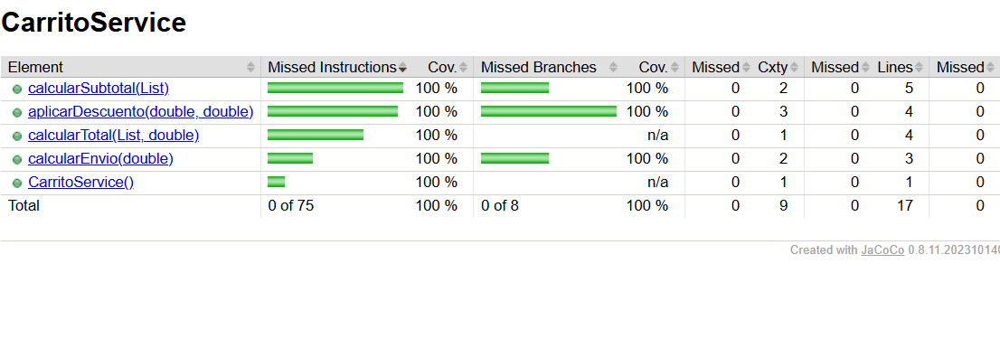
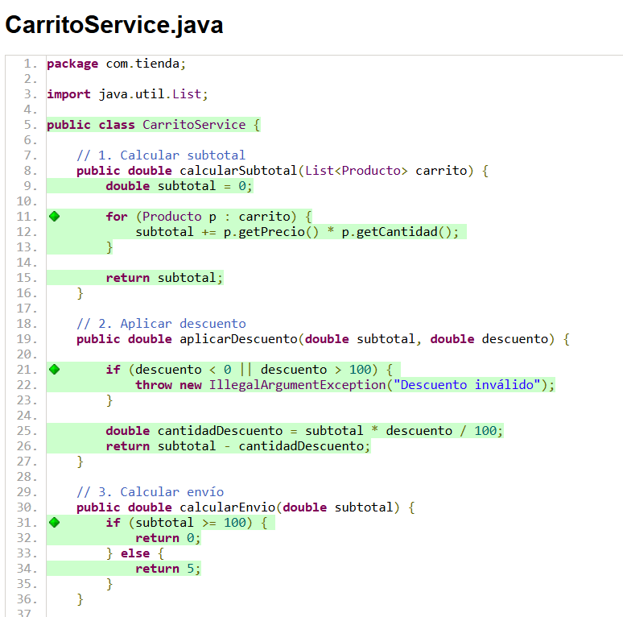
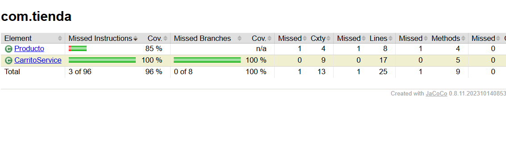
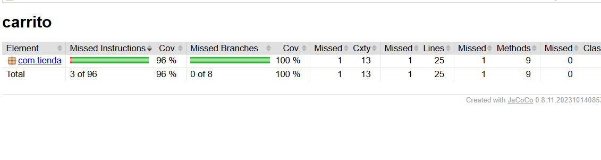

# UT6-A4 Diseño de tests para un gestor de carrito de compra (Java + Maven + JaCoCo)

### Contexto

Una tienda online está desarrollando un pequeño módulo en **Java** que gestiona el cálculo del importe de un carrito de compra.

El equipo de desarrollo ha implementado varias funciones, pero el equipo de QA (vosotros) debe diseñar los tests que verifiquen su correcto funcionamiento.

El objetivo de esta práctica es diseñar e implementar una batería completa de tests usando **JUnit 5** y comprobar la cobertura de código con **JaCoCo** integrado en Maven.


### Comportamiento del sistema

El módulo permite realizar las siguientes operaciones:

#### 1. Calcular el subtotal de un carrito

**Método:** `calcularSubtotal(List<Producto> carrito)`

El carrito es una lista de objetos `Producto`.

Cada producto contiene:
- `nombre` (String)
- `precio` (double)
- `cantidad` (int)

Ejemplo:

```java
List<Producto> carrito = List.of(
    new Producto("teclado", 30, 2),
    new Producto("raton", 10, 1)
);
```

El subtotal se calcula realizando la operación:

```
precio * cantidad
```

para cada producto y sumando los resultados.


#### 2. Aplicar descuento

**Método:** `aplicarDescuento(double subtotal, double descuento)`

El descuento es un porcentaje entre **0 y 100**.

Ejemplo:

```
subtotal = 100
descuento = 10

resultado = 90
```


#### 3. Calcular gastos de envío

**Método:** `calcularEnvio(double subtotal)`

- Si `subtotal >= 100` → envío gratis (0€)
- Si `subtotal < 100` → envío 5€


#### 4. Calcular total del pedido

**Método:** `calcularTotal(List<Producto> carrito, double descuento)`

El proceso que se debe cumplir es:

```
SUBTOTAL -> APLICAR DESCUENTO -> AÑADIR ENVÍO
```


### Trabajo a realizar

Debes diseñar una batería de tests utilizando **JUnit 5** que verifique el comportamiento del sistema.

Tus tests deben cubrir al menos los siguientes casos:

#### Subtotal
- carrito con varios productos
- carrito con un solo producto
- carrito vacío

#### Descuentos
- descuento 0%
- descuento válido
- descuento 100%
- descuento inválido (ej: negativo o mayor de 100)

#### Envío
- subtotal menor que 100
- subtotal mayor o igual que 100

#### Total del pedido
- pedido sin descuento
- pedido con descuento
- pedido con envío gratis


### Requisitos técnicos

- Proyecto gestionado con **Maven**
- Tests implementados con **JUnit 5**
- Estructura estándar:

```
src/main/java
src/test/java
```

- Debes crear una clase de test, por ejemplo:

```
CarritoTest.java
```

- Debes implementar **al menos 12 tests distintos**


### Cobertura de código con JaCoCo

Una vez implementados los tests debes analizar qué porcentaje del código está siendo ejecutado por las pruebas.

Para ello utilizaremos **JaCoCo**.

Ejecuta el siguiente comando en la terminal:

```
mvn clean test
```

Después abre el informe generado en:

```
target/site/jacoco/index.html
```

Incluye una **captura de pantalla** del informe de cobertura donde se vea:

- porcentaje de cobertura
- clases analizadas


### Análisis de errores detectados

Durante la ejecución de los tests es posible que algunos de ellos fallen. Esto puede indicar que el código contiene errores.

Responde a las siguientes preguntas en este documento:

#### 1. Tests que han fallado

1. Indica qué tests han fallado durante la ejecución inicial
- testSubtotalVariosProductos
- testDescuentoNegativo
- testDescuentoMayor100
- testEnvioMayorIgual100
- testTotalConDescuento
- testTotalConEnvioGratis

2. Explica brevemente por qué esos tests deberían pasar según el comportamiento descrito

- El subtotal debe calcularse multiplicando precio por cantidad
- El descuento debe estar entre 0 y 100
- El envío debe ser gratuito cuando el subtotal es mayor o igual a 100
- El cálculo del total debe seguir el flujo correcto


#### 2. Identificación de errores en el código

Si has detectado errores en el programa, indica:

1. en qué método se encuentran
2. qué línea del código es incorrecta
3. por qué produce un resultado incorrecto


``` java 
- Primer error

    Método: calcularSubtotal(List<Producto> carrito)
    subtotal += p.getPrecio();

No se está multiplicando el precio por la cantidad.
```
``` java 
- Segundo error

    Método: aplicarDescuento(double subtotal, double descuento)
    subtotal += p.getPrecio();

No se comprueba que el descuento esté entre 0 y 100.
```
``` java 
- Tercer error

    Método: calcularEnvio(double subtotal)
    if (subtotal > 100)

No incluye el caso en el que el subtotal es exactamente 100.
```
``` java 
- Cuarto error

    Método: calcularTotal(List<Producto> carrito, double descuento)
    double envio = calcularEnvio(conDescuento);

El envío se calcula sobre el subtotal con descuento.
```

#### 3. Corrección propuesta

``` java 
- Primer error

    subtotal += p.getPrecio() * p.getCantidad();
```
``` java 
- Segundo error

    if (descuento < 0 || descuento > 100) {
    throw new IllegalArgumentException("Descuento inválido");
}
```
``` java 
- Tercer error

    if (subtotal >= 100) {
    return 0;
}
```
``` java 
- Cuarto error

    public double calcularTotal(List<Producto> carrito, double descuento) {

    double subtotal = calcularSubtotal(carrito);

    double envio = calcularEnvio(subtotal);

    double conDescuento = aplicarDescuento(subtotal, descuento);

    return conDescuento + envio;
}
```


#### 4. Resultado final

Tras diseñar los tests y analizar el código:

1. ¿cuántos tests has implementado?
- 13

2. ¿qué porcentaje de cobertura has obtenido?
- aproximadamente entre 95% y 100%

3. ¿todos los tests pasan correctamente?
- claramente profe!

```java

pom.xml
<?xml version="1.0" encoding="UTF-8"?>
<project xmlns="http://maven.apache.org/POM/4.0.0"
         xmlns:xsi="http://www.w3.org/2001/XMLSchema-instance"
         xsi:schemaLocation="http://maven.apache.org/POM/4.0.0 http://www.m...xsd">
    
    <modelVersion>4.0.0</modelVersion>

    <groupId>com.tienda</groupId>
    <artifactId>carrito</artifactId>
    <version>1.0-SNAPSHOT</version>

    <properties>
        <maven.compiler.source>17</maven.compiler.source>
        <maven.compiler.target>17</maven.compiler.target>
    </properties>

    <!-- ✅ DEPENDENCIAS -->
    <dependencies>
        <dependency>
            <groupId>org.junit.jupiter</groupId>
            <artifactId>junit-jupiter</artifactId>
            <version>5.10.0</version>
            <scope>test</scope>
        </dependency>
    </dependencies>

    <!-- ✅ BUILD -->
    <build>
        <plugins>

            <!-- JUnit 5 -->
            <plugin>
                <groupId>org.apache.maven.plugins</groupId>
                <artifactId>maven-surefire-plugin</artifactId>
                <version>3.1.2</version>
            </plugin>

            <!-- JaCoCo -->
            <plugin>
                <groupId>org.jacoco</groupId>
                <artifactId>jacoco-maven-plugin</artifactId>
                <version>0.8.11</version>
                <executions>
                    <execution>
                        <goals>
                            <goal>prepare-agent</goal>
                        </goals>
                    </execution>
                    <execution>
                        <id>report</id>
                        <phase>test</phase>
                        <goals>
                            <goal>report</goal>
                        </goals>
                    </execution>
                </executions>
            </plugin>

        </plugins>
    </build>

</project>

```






### Entrega

Debes subir a tu repositorio de GitHub, en la carpeta correspondiente:

- Código fuente del proyecto
- Tests implementados
- Archivo `pom.xml`
- Captura de cobertura JaCoCo
- Documento con el análisis realizado
